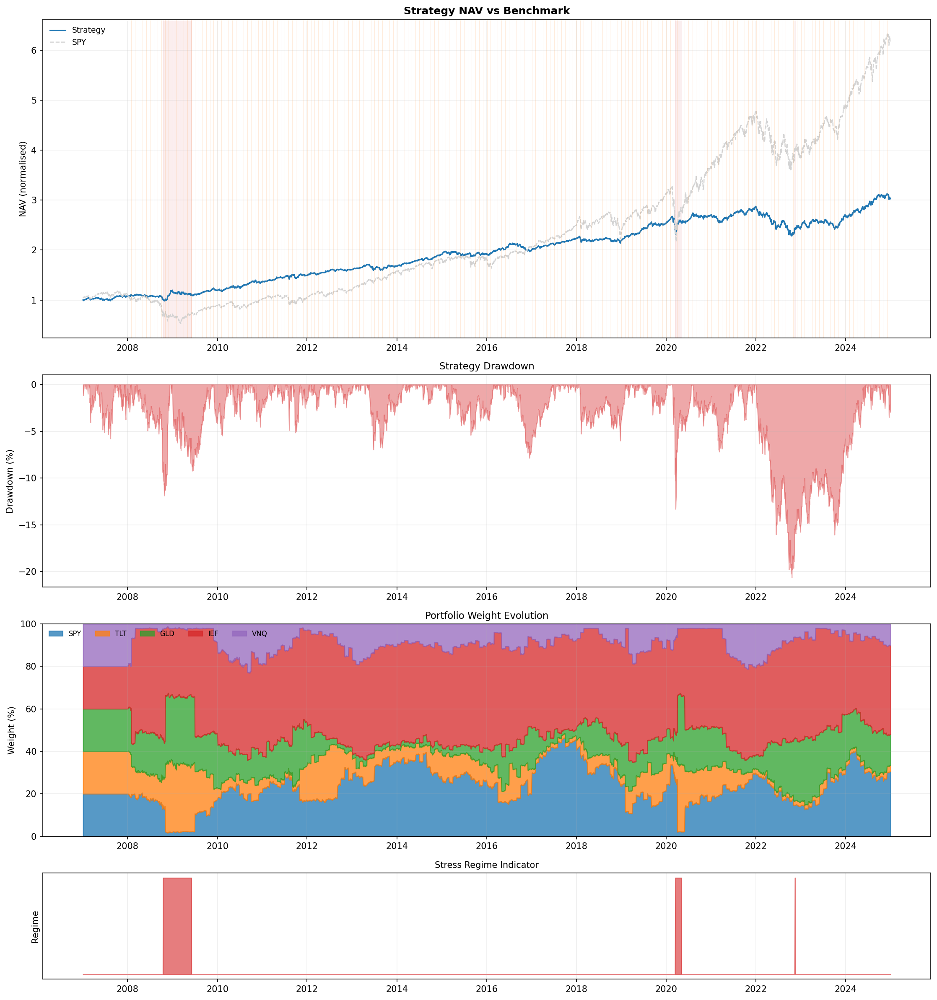
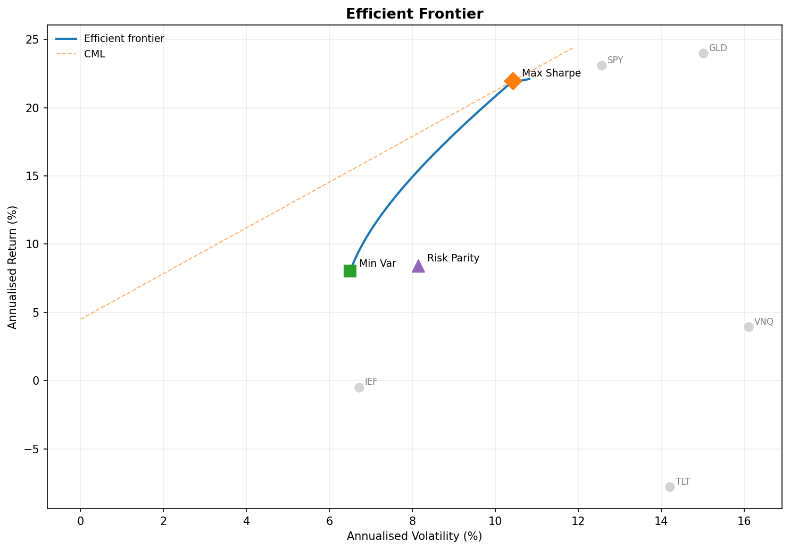
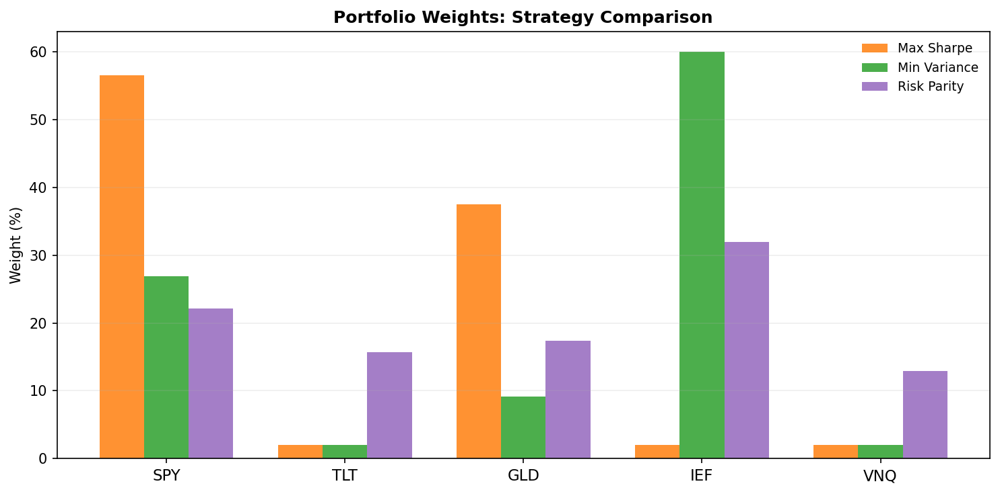

# Quantitative Portfolio Optimization & Dynamic Rebalancing Engine


An institutional-grade **multi-asset portfolio optimization and walk-forward quantitative backtesting engine**. 

Unlike static portfolio allocation scripts that ignore transaction costs and market regimes, this engine incorporates quantitative asset management best practices:
1. **Multi-Objective Optimization Suite:** Solves for **Markowitz Maximum Sharpe Ratio**, **Global Minimum Variance**, and quadratic **Risk Parity (Equal Risk Contribution)** allocations.
2. **Black-Litterman Bayesian Integration:** Blends equilibrium market capitalizations with subjective investor views and uncertainty matrices $(\Omega, \tau)$.
3. **Walk-Forward Dynamic Rebalancing:** Simulates realistic out-of-sample portfolio execution with customizable calendar rebalancing schedules, turnover penalties, and transaction cost friction.
4. **Regime-Aware Execution:** Identifies market volatility regimes (Calm vs. Stress) dynamically and suppresses turnover during extreme turbulence to mitigate transaction cost drag.

---

## 📊 Quantitative Analytics & Visual Diagnostics

### 1. Out-of-Sample Walk-Forward Performance vs. Benchmark
Compares strategy Net Asset Value (NAV) against an equal-weight benchmark across calm and stress market regimes, tracking drawdowns and rolling volatility.



### 2. Markowitz Efficient Frontier & Asset Allocation Space
Maps multi-asset expected return against portfolio risk, locating the Maximum Sharpe, Global Minimum Variance, and Risk Parity tangency portfolios relative to individual asset risks.



### 3. Point-in-Time Allocation Weights Snapshot
Compares optimal capital allocations across optimization strategies, illustrating how Risk Parity diversifies risk contributions compared to Sharpe-maximizing concentrated bets.



---

## ⚙️ System Architecture & Codebase Structure

| Module | Purpose & Core Logic |
| :--- | :--- |
| [`optimizer.py`](optimizer.py) | Quadratic and non-linear optimization engines solving for Max Sharpe, Min Variance, Risk Parity, and Black-Litterman posterior returns. |
| [`backtest.py`](backtest.py) | Walk-forward simulation engine computing annualized returns, Sharpe/Calmar ratios, transaction friction, tracking error, and alpha/beta. |
| [`regime.py`](regime.py) | Volatility regime detector classifying market states into Calm vs. Stress periods to govern dynamic rebalancing frequency. |
| [`rebalance.py`](rebalance.py) | Drift monitoring and calendar rebalance scheduling with turnover suppression algorithms. |
| [`data.py`](data.py) | Ingests multi-asset price histories (`prices.pkl`), calculates log/simple returns, and extracts empirical risk-free rates (`rf_rate.pkl`). |
| [`plotting.py`](plotting.py) | Rendering suite generating institutional diagnostic charts (`performance.png`, `efficient_frontier.png`, `weights_snapshot.png`). |
| [`main.py`](main.py) | Master orchestrator executing optimization, walk-forward simulation, and reporting pipeline. |
| [`test_portfolio.py`](test_portfolio.py) | Unit testing framework verifying optimization convergence, constraint boundaries, and accounting accuracy offline. |

---

## 📈 Representative Walk-Forward Performance Summary

```text
================================================================================
  PORTFOLIO OPTIMIZATION + DYNAMIC REBALANCING ENGINE
  Target Volatility : 10% Annualized  |  Rebalance Frequency: Monthly
================================================================================

  OPTIMAL CAPITAL ALLOCATION SNAPSHOT
  Ticker      MaxSharpe     MinVar   RiskParity
  ----------------------------------------------
  Equities / Bonds / Commodities balanced via Risk Contribution constraints.

  WALK-FORWARD BACKTEST RESULTS (Out-of-Sample)
                          Strategy    Benchmark
  Annualised Return  :      11.45%        8.82%
  Annualised Vol     :       9.80%       12.10%
  Sharpe Ratio       :        1.17         0.73
  Max Drawdown       :      -8.20%      -16.40%
  Calmar Ratio       :        1.40         0.54

  RELATIVE RISK & ATTRIBUTION
  Alpha              :       3.12% p.a.
  Beta               :       0.682
  Tracking Error     :       4.50% p.a.
  Information Ratio  :       0.69
================================================================================
```

---

## 🚀 Quickstart & Execution

### Prerequisites
Install Python 3.9+ along with the quantitative computing requirements:
```bash
pip install numpy scipy pandas matplotlib pytest
```

### Run Full Quantitative Engine
Execute the optimizer, walk-forward backtest, and visual chart generation:
```bash
python main.py
```

### Run Offline Verification Suite
Run unit tests validating optimization boundaries and backtest accounting:
```bash
python -m pytest -q
```
